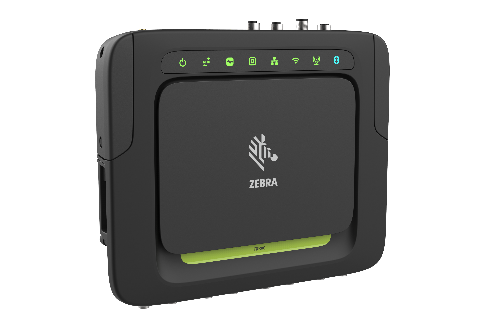
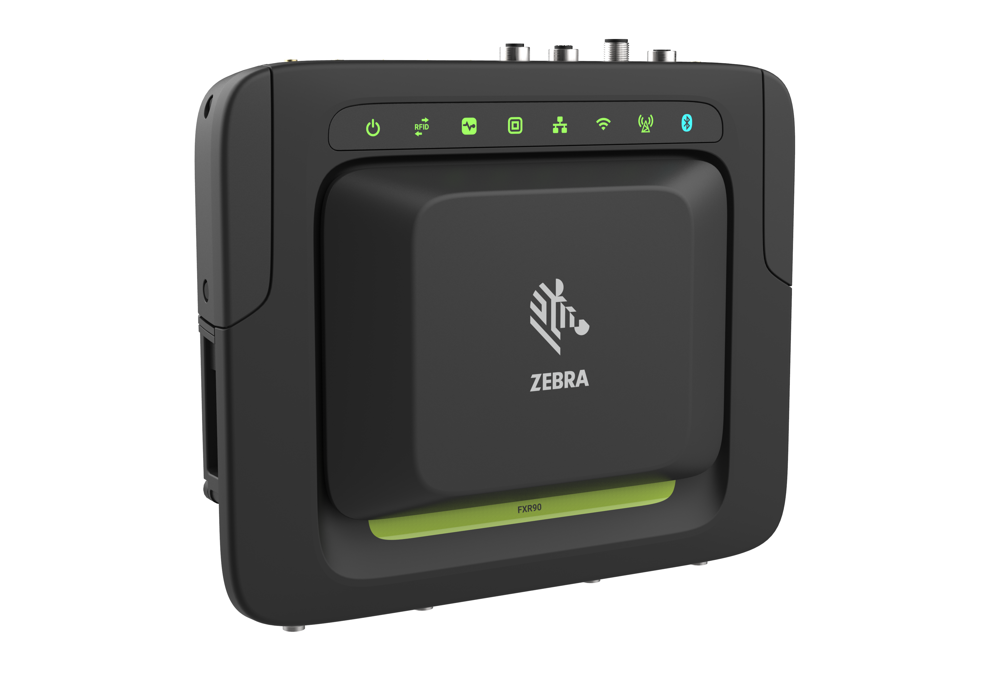
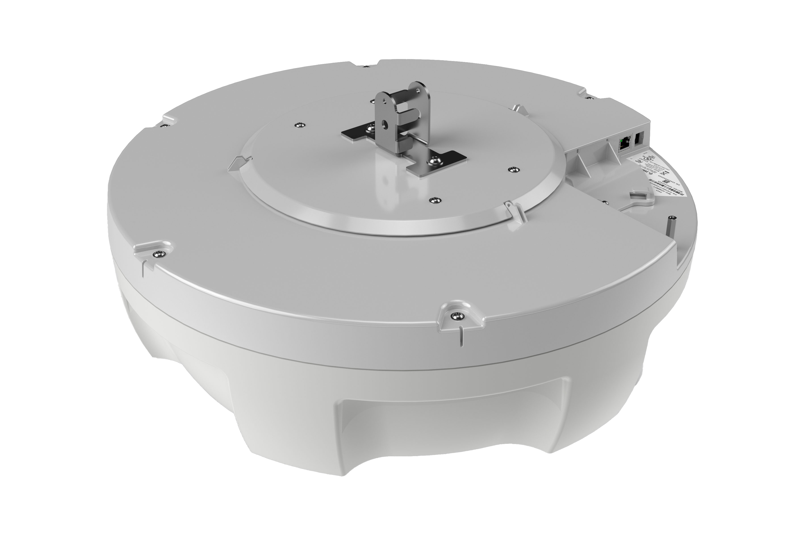
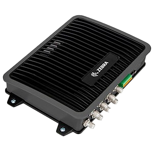

# Welcome to Zebra IoT Connector documentation!
---

# Devices

{: .important }  
For Vulcan Devices

[Visit](https://r-7951.github.io/my-temp){: .btn   .btn-green target="_blank" }

___

{: .important }  
For FX /ATR Series Devices

 
[Visit](https://zebradevs.github.io/rfid-ziotc-docs){: .btn  .btn-green target="_blank" }

